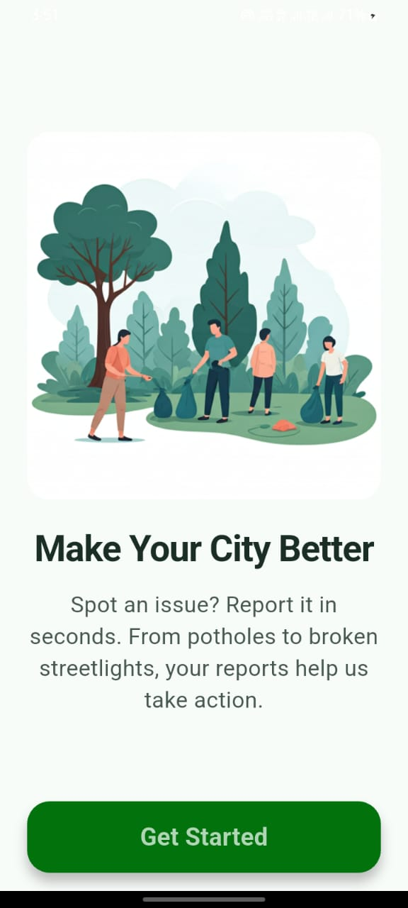
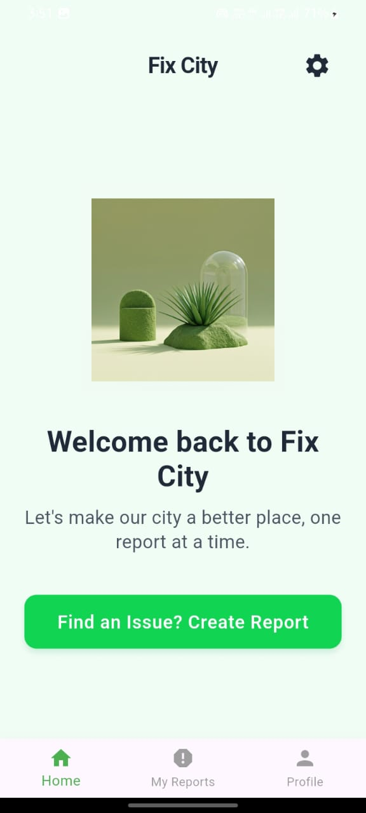
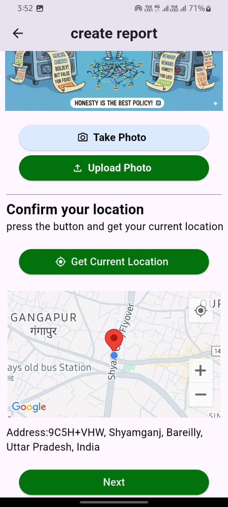
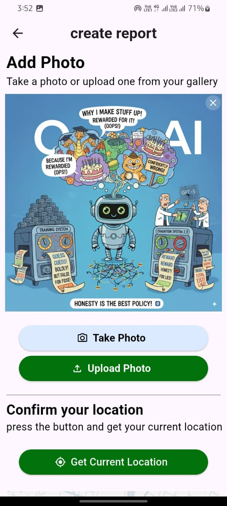
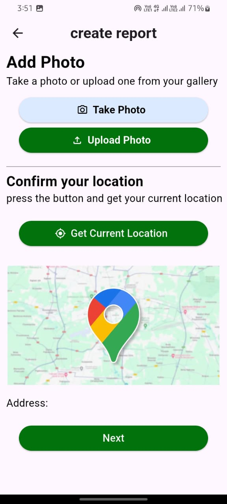

# 🏙️ Fix City – Crowdsourced Civic Issue Reporting and Resolution System

### Team Technovengers | Smart India Hackathon 2025

---

## 📑 Hackathon Details

* **Problem Statement ID:** SIH25031
* **Theme:** Clean & Green Technology
* **PS Category:** Software
* **Team Name:** Technovengers

---

## 📌 Problem Statement

Citizens face daily civic issues such as:

* 🚧 Potholes
* 🗑️ Overflowing garbage
* 💡 Broken streetlights

However, reporting these issues is **difficult, slow, and lacks transparency**. Municipal authorities struggle with **real-time tracking, prioritization, and accountability**. There is **no single platform** that connects citizens and authorities effectively.

---

## 💡 Proposed Solution

**Fix City** is a mobile-first solution that empowers citizens to report civic issues directly to municipal authorities with:

* 📍 **Geo-tagging (GPS + Google Maps)**
* 📸 **Photo evidence upload**
* 🗂️ **Category selection** (waste, roads, streetlights, etc.)
* 🔔 **Real-time push notifications** to keep users updated
* 👥 **Authority dashboard** for issue tracking and resolution

---

## ✨ Key Features

* 📍 **Google Maps API Integration** – precise issue location tagging
* 📸 **Photo-based issue reporting**
* 🔔 **Real-time notifications** (Firebase Cloud Messaging)
* 👥 **Citizen–authority interaction** with status tracking
* 📊 **Dashboard for authorities** to manage, track, and resolve issues

---

## 🛠️ Technology Stack

* **Frontend:** Flutter
* **Backend:** Firebase (Authentication, Realtime Database, Cloud Functions)
* **APIs:** Google Maps API, Geolocation Services
* **Notifications:** Firebase Cloud Messaging
* **Dashboard (Web App):** Firebase

---

## 🔄 Workflow

1. User registers/login via **Firebase Authentication**
2. User **reports an issue** (Photo + Location + Category)
3. Data stored in **Firebase Realtime Database**
4. Concerned authority is **notified automatically** (based on location mapping)
5. Status updates: **Under Review → In Progress → Resolved**
6. Citizen provides **feedback** after resolution

---

## 📷 Screenshots  

  
  
  
  
  
  
  
  
  
  

---

## 🌍 Impact

* ✅ Faster resolution of civic issues
* ✅ Transparency & accountability in governance
* ✅ Citizens empowered with an active voice
* ✅ Data-driven planning for municipalities
* ✅ Cleaner, greener, and more livable cities

---

## 🚀 Future Enhancements

* 🤖 **AI-based image recognition** for auto-categorization
* 🎮 **Gamification & rewards** for active reporters
* 🏳️ **Multilingual support** for wider accessibility
* 📊 **Integration with Swachh Bharat Mission dashboards**

---

## 👥 Team Technovengers

**Fix City – A solution crafted by Team Technovengers for Smart India Hackathon 2025**
